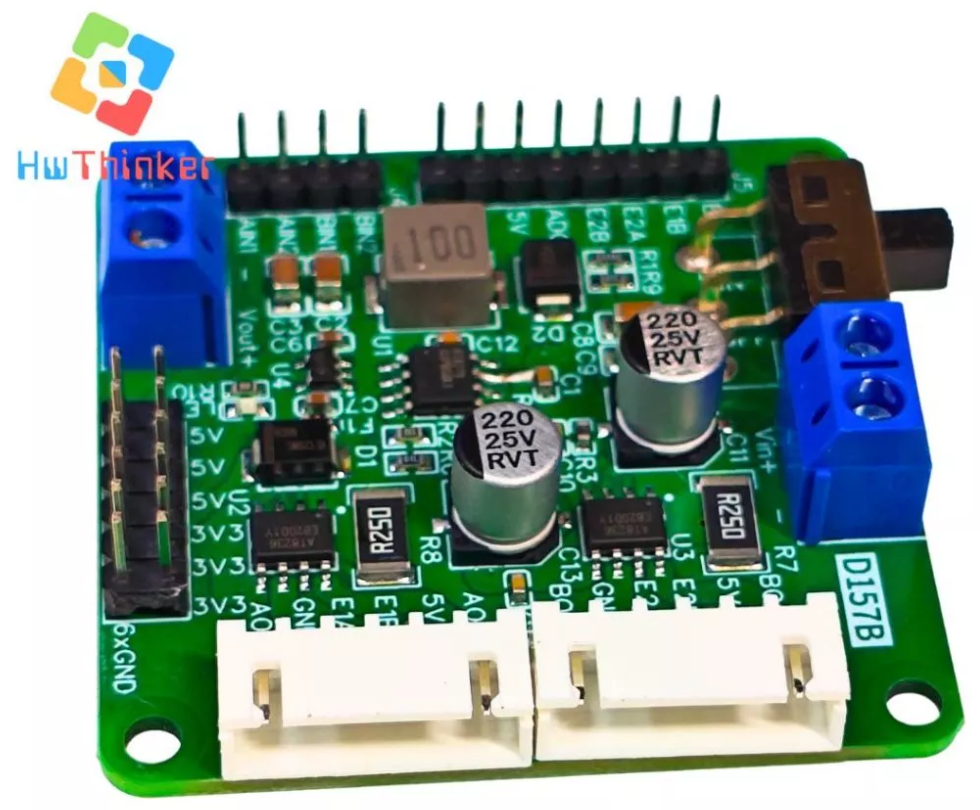
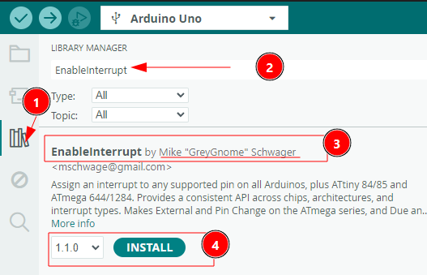

# Panduan Pemula: Interface Driver Motor D157B 2-Channel dengan Arduino Uno dan Mega




Dokumentasi ini dibuat untuk membantu pemula menghubungkan dan mengendalikan 2-Channel Motor Driver (AT8236) menggunakan Arduino Uno. Panduan ini mencakup skema pengkabelan, penjelasan kode, dan cara pengujian.

---

## 1. Pengenalan Produk

**Xtark Dual Channel Motor Driver (AT8236)** adalah modul driver motor performa tinggi yang dapat mengendalikan dua motor DC sekaligus. Modul ini memiliki fitur:

*   **Tegangan Input:** 5.5V - 15V.
*   **Arus:** 3A Kontinu (6A Puncak) per channel.
*   **Fitur Spesial:** Pembacaan Encoder (RPM), Monitor Tegangan Baterai, dan Output Tegangan 5V/3A untuk menyuplai Arduino.
*   **Proteksi:** Arus berlebih, suhu, dan korsleting.

---

## 2. Persiapan Hardware

Siapkan komponen berikut:
1.  **Arduino Board** (Uno, Nano, atau Mega).
2.  **Modul Driver Xtark**.
3.  **2x Motor DC dengan Encoder**.
4.  **Sumber Daya (Baterai)**: 5.5V - 15V (Li-ion 2S/3S disarankan).
5.  **Kabel Jumper**.

---

## 3. Skema Pengkabelan (Wiring)

Hubungkan pin dari Modul Driver ke Arduino sesuai tabel di bawah ini. Pastikan koneksi benar sebelum menyalakan daya!

### Koneksi Kontrol Motor & Encoder

| Pin Driver (Label) | Pin Arduino | Fungsi |
| :--- | :--- | :--- |
| **BIN2** | **Pin 9** | PWM Motor B (M2) |
| **BIN1** | **Pin 8** | Arah Motor B (M2) |
| **AIN2** | **Pin 7** | PWM Motor A (M1) |
| **AIN1** | **Pin 6** | Arah Motor A (M1) |
| **E2A** | **Pin 4** | Encoder Motor Kanan (Fase A) |
| **E2B** | **Pin 5** | Encoder Motor Kanan (Fase B) |
| **E1A** | **Pin 3** (INT1) | Encoder Motor Kiri (Fase A) |
| **E1B** | **Pin 2** (INT0) | Encoder Motor Kiri (Fase B) |
| **ADC** | **Pin A5** | Monitor Tegangan Baterai |
| **GND** | **GND** | Ground (Wajib Terhubung!) |

### Koneksi Daya (Power)

*   Terminal Power (Input): Hubungkan Baterai (+) dan (-) ke terminal input daya di driver.
*   5V Output (Opsional): Anda bisa menyalakan Arduino langsung dari pin 5V driver ke pin 5V/VIN Arduino (jika jumper power diset benar).

---

## 4. Persiapan Software

Kode program `controldemo-v2.ino` menggunakan library tambahan untuk membaca encoder dengan lebih responsif di semua pin.

### Langkah 1: Install Library
Anda perlu menginstal library **EnableInterrupt**.
1.  Buka Arduino IDE.
2.  Pergi ke **Sketch** -> **Include Library** -> **Manage Libraries...**
3.  Cari "**EnableInterrupt**" oleh Mike 'GreyGnome' Schwager.
4.  Klik **Install**.



### Langkah 2: Upload Kode
Note: File kode adalah `controldemo-v2.ino`.
1.  Download  controldemo-v2.ino di sini
2.  Buka file `controldemo-v2.ino` di Arduino IDE.
3.  Pilih Board yang sesuai (Misal: Arduino Uno).
4.  Pilih Port COM yang benar.
5.  Klik tombol **Upload**.

---

## 5. Cara Penggunaan & Perintah Serial

Setelah upload berhasil, biarkan kabel USB terhubung untuk memonitor data serial.

1.  Buka **Serial Monitor** di Arduino IDE (Tools -> Serial Monitor).
2.  Set baud rate ke **9600**.
3.  Anda akan melihat pesan pembuka "AT8236 Motor Driver".

### Daftar Perintah (Ketik di Serial Monitor)

Ketik karakter atau angka berikut lalu tekan Enter:

*   **Angka `0` s/d `255`**: Menjalankan motor maju dengan kecepatan PWM tersebut (Contoh: ketik `150`).
*   **Angka `-1` s/d `-255`**: Menjalankan motor mundur (Contoh: ketik `-200`).
*   **Huruf `s`**: STOP. Menghentikan kedua motor seketika.
*   **Huruf `a`**: Mengaktifkan/Mematikan mode **Auto-Reverse**. (Default: ON, motor akan maju-mundur otomatis setiap 2 detik).
*   **Huruf `r`**: Reset penghitung pulsa encoder menjadi 0.
*   **Huruf `i`**: Info. Menampilkan status lengkap (Tegangan Baterai, RPM, Total Pulsa, Arah).

### Membaca Data di Serial Monitor
Secara otomatis, setiap 100ms sistem akan mengirim data seperti ini:
```text
L: 120.5 RPM | R: 121.0 RPM | V: 11.20V | PWM: 150 | FWD
```
*   **L / R RPM**: Kecepatan putar motor Kiri dan Kanan.
*   **V**: Tegangan baterai yang terdeteksi.
*   **PWM**: Nilai daya yang diberikan.
*   **FWD/REV**: Arah putaran.

---

## 6. Tips Untuk Pemula

1.  **Cek Tegangan Baterai:** Pastikan tegangan baterai Anda di atas 5.5V. Jika di bawah itu, driver mungkin tidak bekerja optimal. Gunakan fitur perintah `i` atau lihat di serial monitor untuk memantau tegangan.
2.  **Motor Terbalik?** Jika Anda memberikan perintah maju (angka positif) tapi roda berputar mundur, tukar posisi kabel motor motor (Misal: tukar kabel Merah dan Hitam pada terminal motor output).
3.  **Encoder Tidak Terbaca?** Pastikan kabel encoder E1A/E1B dan E2A/E2B terpasang kuat. Jika RPM tetap 0 saat motor berputar, periksa koneksi kabel kecil dari motor ke driver.

Selamat Mencoba!
